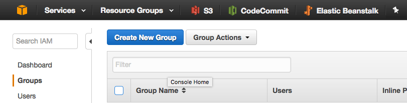
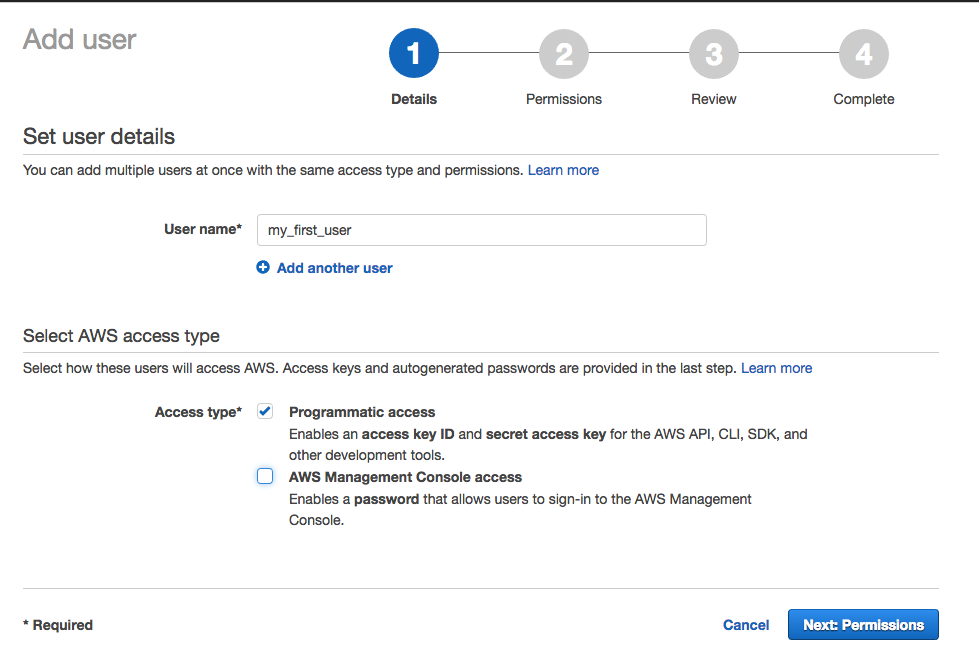

# IAM 

- [Managing Users And Access](#managing-users-and-access)
- [Step 1: Create a Group](#step-1-create-a-group)
- [Step 2: Attach Policies to your Group](#step-2-attach-policies-to-your-group)
    - [CodeCommit](http://docs.aws.amazon.com/codecommit/latest/userguide/setting-up-gc.html)
- [Step 3: Create a user](#step-3-create-a-user)
- [Step 4: Add users to your group](step-4-add-users-to-your-group)
- [Reference](https://www.chrisjmendez.com/2017/01/30/deploying-rails-5-from-aws-codecommit-to-elastic-beanstalk-part-1/)
 

# Managing Users And Access

## Step 1: Create a Group

Groups are utilities that help you establish permissions to a group of users. As a first step, visit the [Groups](https://console.aws.amazon.com/iam/home#/groups) section within Identity and Access Management (IAM) console and create a new group.

## Step 2: Attach Policies to your Group

Once you've created a group, you'll need to grant access. I offer [a few policies](http://docs.aws.amazon.com/codecommit/latest/userguide/access-permissions.html#access-permissions-managed-policies) to CodeCommit contributors.

- **AWSCodeCommitFullAccess** offers full access to CodeCommit.
- **IAMSelfManageServiceSpecificCredentials** allows developers a way to authenticate using git credentials.
- **IAMUserSSHKeys** enables users to authenticate using SSH credentials.
- **IAMReadOnlyAccess** provides IAM read-only access.

This is what your group should look like.

## Step 3: Create a user

If you haven't created a user yet, visit IAM on AWS console and create a new user with Access Keys.

## Step 4: Add users to your group

The next step is to add your users to this specific group using the [IAM AWS console](https://console.aws.amazon.com/iam/home#/users).

